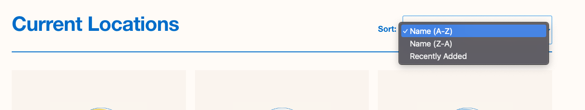

# Take home test for Javier Alvarez
### Changelog.
- Forked from the original repository as requested
- Installed and configured Cypress framework + Cucumber
- Opened a pull request in order to get feedback from reviewers
- Did small commits for each project building objective
- Implemented mochawesome as reporting tool
- Implemented linter.
- Added several test cases to feature file in order to achieve the assignment

### How to run
- Make sure to get the latest version from the repository
- Install all the dependencies : npm i
- In the terminal/console , run i.e: npm run cypress:production
  (check package.json for all the available scripts)

### How to check the report
Although the user can see a brief report at the console itself, after running the tests with the stated scripts, head to /cypress/report/mochawesome-report and open the .html report on a browser

### How to interact with environments
- Each scenario in the feature file should be tagged with the environment tag i.e:@production
- Run the related script based on tags i.e: npm run cypress:staging. This will run only tests that are candidate to that environment. Also , in the script, a node variable can be passed through a CI tool to choose which environment to use and to provide integration

# Take home test for QA Engineer

The main goal of this test is to evaluate your code organization, maintainability, and readability; We don’t expect you to complete all cases, with one or two well-documented and explained cases will be enough.

All members of the Engineering team should be able to update and extend your work so we prioritize things like:

- project’s folder organization
- well history documentation, small commits and well documented PRs
- don’t reinvent the wheel

You will have to fork this repository, add [Mauricio](https://github.com/mdottavio) and [Fernando](https://github.com/fer8a) as collaborators and create one (or more) PRs again it;
We appreciate collaboration between team members so, create your first PR as soon as you have something to evaluate (initial setup, folder structure, etc) and expect some feedback on them :)

### Test description

Implement and organize an E2E suite test with [Cypress.io](http://cypress.io/) and [Cucumber.io](https://cucumber.io/) to validate the following cases.

- navigate to our landing page located on [https://www.tryminded.com/](https://www.tryminded.com/)
- validate that the site is fully loaded.
- scroll to the bottom of the page.
- close the banner "Get your first month for just $25"

- unfold the Diagnosis "Anxiety", located in the "What we treat." section and validate the user can read the description

- navigate to the "Locations" section (by clicking the option on the menu)
- re order the state list by "Name (Z-A)"

- select (click) the state "Texas", validate the user is redirected to [https://www.tryminded.com/location/texas](https://www.tryminded.com/location/texas)

The cases should be tested on mobile (iPhone 12Pro) and desktop.

### Extras - nice to have

- we implement `typescript` in our JS's repositories, try to implement it on your test.
- we currently have 3 environments; `development`, `staging`, and `production`. How would you organize the test suite to run tests on the different environments and integrate them with our CI/CD tool?
